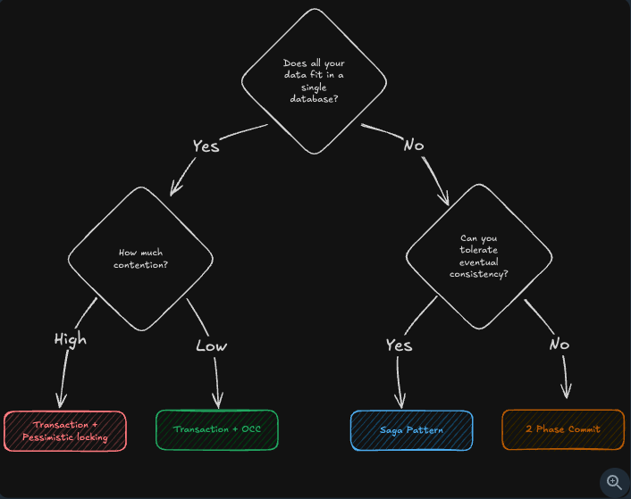

# On Contention

- Contention is when multiple DB transactions are wanting to read/update the same resource (think row)
- Solutions:
  - Single DB node:
    1. Pessimistic Locks (Think `FOR UPDATE`):
       a. Assumes that contentions/race will eventually happen, therefore acts in advance.
       b. Suited for high contention scenarios/write heavy systems.
       c. Has a performance implications.

    2. Isolation Levels - how do concurrent txns in a DB interact:
       a. `READ UNCOMMITTED` - Can see uncommitted changes from other transactions (rarely used)
       b. `READ COMMITTED` - Can only see committed changes (default in PostgreSQL)
       c. `REPEATABLE READ` - Same data read multiple times within a transaction stays consistent (default in MySQL)
       d. `SERIALIZABLE` - Strongest isolation, transactions appear to run one after another. Extremely detrimental to performance, especially for high contention scenarios.

    3. Optimistic Concurrency Control (Think `compare-and-swap` pattern):
       a. Optimistically assumes that contentions/race will be rare.
       b. Suited for low contention/read heavy systems.
       c. Low performance implication.

- Multiple DB nodes:
  - The problem gets significantly difficult here. Requires coordination between multiple nodes.
  1. Two-phase Commit (2PC):
     - Coordinatar and nodes. Coordinator issues Prepare and Commit commands.
     - Extremely flaky and under-performant.
     - However, provides strong consistency gurantees. Therefore, keep it as a last resort, but when you need it, then you need it!

  2. Distributed locks (Think `Redis TTL`, `Zookeeeper/etcd`):
     - Top choice when you need application level distributed locking for better UX. Think seat reservation for a small window of time.

# On Scaling Reads

- When a need to scale read arises, follow this (in order):
  - Optimize read performance within your DB (index & denormalization)
  - Scale your DB horizontally (read replicas and/or sharding)
  - Add external caching layers (application and/or CDN)

# On Redis (In-memory datastructure store)

## Popular Usecases

- Cache
- Distributed locks
- Rate limiter
- Stream
- Heap
- Geospatial Indexes
- Pub/Sub
